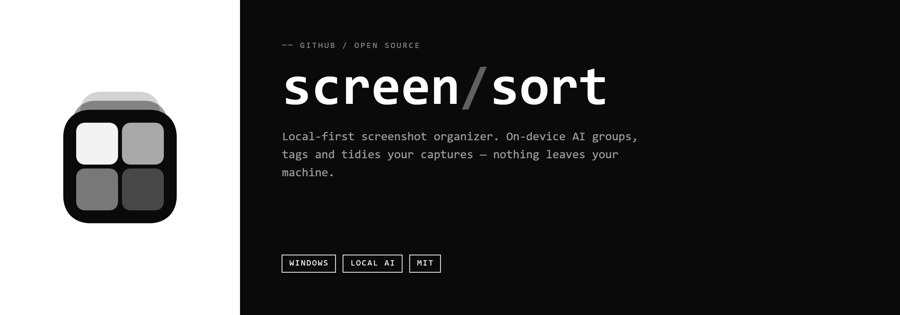

# Screenshot Sorter

> [🇬🇧 Read in English](README.md)



Автоматически сортирует скриншоты по папкам с помощью [CLIP](https://github.com/mlfoundations/open_clip) — нейросети для классификации изображений по тексту. Работает как **приложение в системном трее** — бросил скриншот в папку, он тут же отсортирован.

  

---

## Возможности

- **Трей-приложение** — живёт в системном трее, сортирует новые скриншоты по мере поступления
- **CLIP классификация** — не нужны обучающие данные, просто редактируй текстовые подсказки в `config.yaml`
- **Детектор дублей** — перцептивный хеш пропускает почти одинаковые изображения
- **Настраиваемые категории** — добавляй, переименовывай, удаляй категории только через YAML
- **GPU не нужен** — работает на CPU; при первом запуске скачиваются модели ~400 МБ

---

## Установка (Windows)

Скачай **`Install_ScreenshotSorter.exe`** со страницы [Releases](https://github.com/actoweed/ScreenSort/releases) и запусти.

- Python не нужен — всё включено в установщик
- При первом запуске модели ИИ скачаются автоматически (~400 МБ)
- Приложение начнёт следить за папкой скриншотов и добавит себя в автозапуск Windows

---

## Использование

После установки приложение работает в фоне:

- **Иконка в трее** (правый нижний угол) → правый клик для меню
- **Начать / Остановить слежку** — включить/выключить автосортировку
- **Сменить папку** — выбрать другую папку для слежки
- **Открыть папку** — открыть папку с отсортированными файлами

Настройки сохраняются в `%USERPROFILE%\.screenshot_sorter_config.json`.

---

## Настройка категорий

Отредактируй `config.yaml` (после установки: `%LOCALAPPDATA%\ScreenshotSorter\config.yaml`):

```yaml
categories:
  code:
    description: "Исходный код, терминал, инструменты разработчика"
    prompts:
      - "a screenshot of source code in a code editor"
      - "a screenshot of a terminal or command line interface"

  invoices:
    description: "Финансовые документы и счета"
    prompts:
      - "a screenshot of an invoice or receipt"
      - "a screenshot of a financial document"

# Минимальная уверенность для присвоения категории (0.0–1.0).
# Ниже = сортирует агрессивнее, выше = больше уходит в 'other'
confidence_threshold: 0.10

# Модель CLIP — больше = точнее, но медленнее
# Варианты: ViT-B-32, ViT-B-16, ViT-L-14
clip_model: "ViT-B-32"
```

> Подсказки (`prompts`) должны быть на **английском** — CLIP обучена на англоязычных текстах.

---

## Как это работает

1. **[CLIP](https://github.com/mlfoundations/open_clip)** переводит изображение и текстовые подсказки в одно векторное пространство — побеждает категория с наиболее близким вектором.
2. **[imagehash](https://github.com/JohannesBuchner/imagehash)** вычисляет перцептивный хеш каждого файла — дубли тихо пропускаются.
3. **[watchdog](https://github.com/gorakhargosh/watchdog)** слушает события файловой системы — никакого поллинга, ноль CPU в простое.

---

## Сборка установщика

Требования: Python 3.10+, [NSIS](https://nsis.sourceforge.io/Download).

```bash
git clone https://github.com/actoweed/ScreenSort
cd ScreenSort
python installer/build_installer.py
```

Скрипт автоматически:
1. Скачает Python 3.11 embeddable (~10 МБ)
2. Скачает `get-pip.py`
3. Соберёт `installer/Output/Install_ScreenshotSorter.exe` через NSIS

---

## Структура проекта

```
ScreenSort/
├── config.yaml                   # Конфигурация категорий по умолчанию
├── pyproject.toml
├── screenshot_sorter/
│   ├── tray_app.py               # Трей-приложение (Win32/pystray)
│   ├── first_run.py              # Первый запуск: загрузка моделей
│   ├── classifier.py             # CLIP классификация
│   ├── watcher.py                # Слежка за папкой (watchdog)
│   ├── deduplicator.py           # Детектор дублей (перцептивный хеш)
│   ├── mover.py                  # Перемещение файлов
│   └── cli.py                    # CLI интерфейс
├── installer/
│   ├── build_installer.py        # Скрипт сборки установщика
│   ├── installer.nsi             # NSIS скрипт
│   └── assets/
│       └── icon.ico
└── tests/
    └── test_classifier.py
```

---

## Разработка

```bash
git clone https://github.com/actoweed/ScreenSort
cd ScreenSort
pip install -e ".[dev]"

# Запустить трей-приложение напрямую
python -m screenshot_sorter.tray_app

# CLI
python -m screenshot_sorter sort ./my-screenshots
python -m screenshot_sorter search "текст для поиска"

# Тесты
pytest tests/
```

---

## Лицензия

MIT
